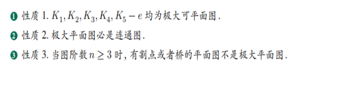
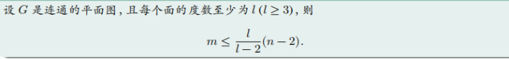
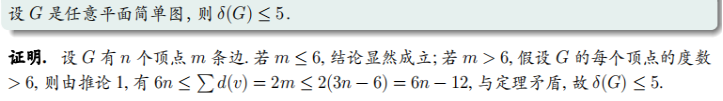
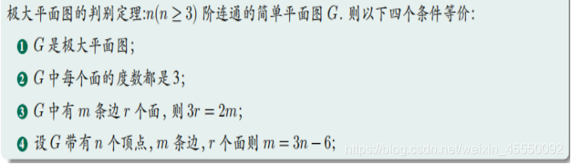

# 数据结构
## 笛卡尔树
小根笛卡尔树
```cpp
    cin >> n;
    for (int i = 0;i < n;++i)cin >> nums[i];
    for (int i = 0;i < n;++i)rs[i] = -1;
    for (int i = 0;i < n;++i)ls[i] = -1;
    top = 0;
    for (int i = 0; i < n; i++) {
        int k = top;
        while (k > 0 && nums[stk[k - 1]] > nums[i]) k--;
        if (k) rs[stk[k - 1]] = i;  // rs代表笛卡尔树每个节点的右儿子
        if (k < top) ls[i] = stk[k];  // ls代表笛卡尔树每个节点的左儿子
        stk[k++] = i;
        top = k;
    }
```

## 线段树

```cpp
struct Info {
    Info operator+ (const Info& x) {

    }
}tree[MAXN << 2];

int n;
void update(int p, int x, int l = 1, int r = n, int i = 1) {
    if (l > r) return;
    if (p < l || r < p) return;
    if (l == r) {
        tree[i] = Info();
        return;
    }
    int mid = l + r >> 1;
    update(p, x, l, mid, i << 1);
    update(p, x, mid + 1, r, i << 1 | 1);
    tree[i] = tree[i << 1] + tree[i << 1 | 1];
}

Info query(int ql, int qr, int l = 1, int r = n, int i = 1) {
    if (l > r) return Info();
    if (qr < l || r < ql)return Info();
    if (ql <= l && r <= qr)return tree[i];
    int mid = l + r >> 1;
    return query(ql, qr, l, mid, i << 1) + query(ql, qr, mid + 1, r, i << 1 | 1);
}
```

### lazy tag
```cpp
#define ln(x) (x*2)
#define rn(x) (x*2+1)
i64 segment_tree[MAXN<<2], lazy_tag[MAXN<<2];
void push_up(int x) {
    segment_tree[x] = segment_tree[ln(x)] + segment_tree[rn(x)];
}

void setup(int l = 1, int r = n, int i = 1) {
    if (r < l)return;
    if (l == r) {
        segment_tree[i] = nums[l];
        return;
    }
    auto mid = l + r >> 1;
    setup(l, mid, ln(i));
    setup(mid + 1, r, rn(i));
    push_up(i);
}

void push_down(int x, int l, int r) {
    lazy_tag[ln(x)] += lazy_tag[x];
    lazy_tag[rn(x)] += lazy_tag[x];
    int mid = l + r >> 1;
    segment_tree[ln(x)] += (mid - l + 1) * lazy_tag[x];
    segment_tree[rn(x)] += (r - mid) * lazy_tag[x];
    lazy_tag[x] = 0;
}

void update(int ul, int ur, int x, int l = 1, int r = n, int i = 1) {
    if (r < l)return;
    if (ul > r || ur < l)return;
    if (ul <= l && r <= ur) {
        lazy_tag[i] += x;
        segment_tree[i] += (r - l + 1) * x;
        return;
    }
    auto mid = l + r >> 1;
    push_down(i, l, r);
    update(ul, ur, x, l, mid, ln(i));
    update(ul, ur, x, mid + 1, r, rn(i));
    push_up(i);
}

i64 query(int pos, int l = 1, int r = n, int i = 1) {
    if (r < l)return 0;
    if (pos > r || pos < l)return 0;
    if (l == pos && pos == r)
        return segment_tree[i];
    auto mid = l + r >> 1;
    push_down(i, l, r);
    return query(pos, l, mid, ln(i)) + query(pos, mid + 1, r, rn(i));
}
```

## Fenwick Tree 树状数组

```cpp
template<typename T>
struct Fenwick {
    int n;
    std::vector<T> a;

    Fenwick(int n_ = 0) {
        init(n_);
    }

    void init(int n_) {
        n = n_;
        a.assign(n + 5, T{});
    }

    void add(int x, const T& v) {
        for (int i = x; i <= n; i += i & -i) {
            a[i] = a[i] + v;
        }
    }

    T sum(int x) {
        T ans{};
        for (int i = x; i > 0; i -= i & -i) {
            ans = ans + a[i];
        }
        return ans;
    }

    T rangeSum(int l, int r) {
        return sum(r) - sum(l);
    }

    int select(const T& k) {
        int x = 0;
        T cur{};
        for (int i = 1 << std::__lg(n); i; i /= 2) {
            if (x + i <= n && cur + a[x + i] <= k) {
                x += i;
                cur = cur + a[x];
            }
        }
        return x;
    }
};
```

## dsu并查集

```cpp
struct dsu {
    std::vector<int> d;
    dsu(int n) { d.resize(n); iota(d.begin(), d.end(), 0); }
    int get_root(int x) { return d[x] = (x == d[x] ? x : get_root(d[x])); };
    bool merge(int u, int v) {
        if (get_root(u) != get_root(v)) {
            d[get_root(u)] = get_root(v);
            return true;
        }
        else return false;
    }
};
```

## two-sat
2sat方案计数为NPC问题
```cpp
struct TwoSat {
    int n;
    std::vector<std::vector<int>> e;
    std::vector<bool> ans;
    TwoSat(int n) : n(n), e(2 * n), ans(n) {}
    void addClause(int u, bool f, int v, bool g) {
        e[2 * u + !f].push_back(2 * v + g);
        e[2 * v + !g].push_back(2 * u + f);
    }
    void notClause(int u, bool f, int v, bool g) {
        addClause(u, !f, v, !g) ;
    }
    bool satisfiable() {
        std::vector<int> id(2 * n, -1), dfn(2 * n, -1), low(2 * n, -1);
        std::vector<int> stk;
        int now = 0, cnt = 0;
        std::function<void(int)> tarjan = [&](int u) {
            stk.push_back(u);
            dfn[u] = low[u] = now++;
            for (auto v : e[u]) {
                if (dfn[v] == -1) {
                    tarjan(v);
                    low[u] = std::min(low[u], low[v]);
                } else if (id[v] == -1) {
                    low[u] = std::min(low[u], dfn[v]);
                }
            }
            if (dfn[u] == low[u]) {
                int v;
                do {
                    v = stk.back();
                    stk.pop_back();
                    id[v] = cnt;
                } while (v != u);
                ++cnt;
            }
        };
        for (int i = 0; i < 2 * n; ++i) if (dfn[i] == -1) tarjan(i);
        for (int i = 0; i < n; ++i) {
            if (id[2 * i] == id[2 * i + 1]) return false;
            ans[i] = id[2 * i] > id[2 * i + 1];
        }
        return true;
    }
    std::vector<bool> answer() { return ans; }
};
```

# 字符串
## kmp 
前缀函数
```cpp
vector<int> prefix_function(string s) {
  int n = (int)s.length();
  vector<int> pi(n);
  for (int i = 1; i < n; i++) {
    int j = pi[i - 1];
    while (j > 0 && s[i] != s[j]) j = pi[j - 1];
    if (s[i] == s[j]) j++;
    pi[i] = j;
  }
  return pi;
}
```
kmp
```cpp
vector<int> find_occurrences(string text, string pattern) {
  string cur = pattern + '#' + text;
  int sz1 = text.size(), sz2 = pattern.size();
  vector<int> v;
  vector<int> lps = prefix_function(cur);
  for (int i = sz2 + 1; i <= sz1 + sz2; i++) {
    if (lps[i] == sz2) v.push_back(i - 2 * sz2);
  }
  return v;
}
```
## z函数
```cpp
vector<int> z_function(string s) {
  int n = (int)s.length();
  vector<int> z(n);
  for (int i = 1, l = 0, r = 0; i < n; ++i) {
    if (i <= r && z[i - l] < r - i + 1) {
      z[i] = z[i - l];
    } else {
      z[i] = max(0, r - i + 1);
      while (i + z[i] < n && s[z[i]] == s[i + z[i]]) ++z[i];
    }
    if (i + z[i] - 1 > r) l = i, r = i + z[i] - 1;
  }
  return z;
}
```

## AC自动机

```cpp
struct AhoCorasick {
    static constexpr int ALPHABET = 26;
    struct Node {
        int len;
        int link;
        std::array<int, ALPHABET> next;
        Node() : len{ 0 }, link{ 0 }, next{} {}
    };

    std::vector<Node> t;

    AhoCorasick() {
        init();
    }

    void init() {
        t.assign(2, Node());
        t[0].next.fill(1);
        t[0].len = -1;
    }

    int newNode() {
        t.emplace_back();
        return t.size() - 1;
    }

    int add(const std::string& a) {
        int p = 1;
        for (auto c : a) {
            int x = c - 'a';
            if (t[p].next[x] == 0) {
                t[p].next[x] = newNode();
                t[t[p].next[x]].len = t[p].len + 1;
            }
            p = t[p].next[x];
        }
        return p;
    }

    void get_fail() {
        std::queue<int> q;
        q.push(1);

        while (!q.empty()) {
            int x = q.front();
            q.pop();

            for (int i = 0; i < ALPHABET; i++) {
                if (t[x].next[i] == 0) {
                    t[x].next[i] = t[t[x].link].next[i];
                }
                else {
                    t[t[x].next[i]].link = t[t[x].link].next[i];
                    q.push(t[x].next[i]);
                }
            }
        }
    }

    std::vector<int> work(std::string s) {
        get_fail();
        int p = 1;
        std::vector<int> f(t.size());
        for (auto c : s) {
            p = next(p, c - 'a');
            f[p]++;
        }

        std::vector<std::vector<int>> adj(t.size());
        for (int i = 2; i < t.size(); i++) {
            adj[link(i)].push_back(i);
        }

        std::function<void(int)> dfs = [&](int x) -> void {
            for (auto y : adj[x]) {
                dfs(y);
                f[x] += f[y];
            }
            };
        dfs(1);
        return f;
    }

    int next(int p, int x) {
        return t[p].next[x];
    }

    int link(int p) {
        return t[p].link;
    }

    int len(int p) {
        return t[p].len;
    }

    int size() {
        return t.size();
    }
};
```

## 马拉车

```cpp
struct Manachar {
    std::vector<int> d1, d2;
    Manachar(std::string s) {
        int n = s.length();
        d1.assign(n, 0);
        d2.assign(n, 0);
        for (int i = 0, l = 0, r = -1;i < n;++i) {
            int k = (i > r) ? 1 : std::min(d1[l + r - i], r - i + 1);
            while (i + k < n && i - k >= 0 && s[i + k] == s[i - k])k++;
            d1[i] = k--;
            if (i + k > r) {
                r = i + k;
                l = i - k;
            }
        }
        for (int i = 0, l = 0, r = -1;i < n;++i) {
            int k = (i > r) ? 0 : std::min(d2[l + r - i + 1], r - i + 1);
            while (i + k < n && i - k - 1 >= 0 && s[i + k] == s[i - k - 1])k++;
            d2[i] = k--;
            if (i + k > r) {
                r = i + k;
                l = i - k - 1;
            }
        }
    }
    bool check(int l, int r) {
        if (r < l)return false;
        int len = r - l + 1;
        if (len % 2) {
            return d1[l + len / 2] * 2 - 1 < len;
        }
        else {
            return d2[l + len / 2] * 2 < len;
        }
    }
};
```

## 双模哈希 哈希字符串 树上哈希 取随机数

```cpp

#define M1 998244853
#define M2 1000000009
#define N 500000

i64 qpow(i64 x, i64 p, i64 mod) {
    i64 ret = 1;
    while (p) {
        if (p & 1)ret = ret * x % mod;
        p >>= 1;
        x = x * x % mod;
    }
    return ret;
}

struct hsh {
    i64 w1, w2;
    hsh operator * (const int w) {
        return { w1 * w % M1,w2 * w % M2 };
    }
    hsh operator * (const hsh w) {
        return { w1 * w.w1 % M1,w2 * w.w2 % M2 };
    }
    hsh operator + (const hsh w) {
        return { (w1 + w.w1) % M1,(w2 + w.w2) % M2 };
    }
    hsh operator - (const hsh w) {
        return { (w1 + M1 - w.w1) % M1,(w2 + M2 - w.w2) % M2 };
    }
    bool operator == (const hsh w) {
        return (w1 == w.w1) && (w2 == w.w2);
    }
    i64 wt() {
        return M2 * w1 + w2;
    }
    void show() { std::cout << w1 << ' ' << w2 << '\n'; }
}pw[N + 50], inv[N + 50];

std::mt19937_64 rng(std::chrono::steady_clock::now().time_since_epoch().count());

int dep[MAXN], lg[MAXN], p[MAXN][30];
void init() {
    int b1 = rng() % M1 + 1, b2 = rng() % M2 + 1;
    pw[0] = inv[0] = { 1,1 };
    pw[1] = { b1,b2 };
    inv[1] = { qpow(b1,M1 - 2,M1),qpow(b2,M2 - 2,M2) };
    for (int i = 2;i <= N;i++) {
        pw[i] = pw[i - 1] * pw[1];
        inv[i] = inv[i - 1] * inv[1];
    }
    for (int i = 1;i <= N;++i)
        lg[i] = lg[i >> 1] + 1;
}

int lca(int x, int y) {
    if (dep[x] < dep[y])std::swap(x, y);
    while (dep[x] > dep[y])
        x = p[x][lg[dep[x] - dep[y]] - 1];
    if (x == y)return x;
    for (int k = lg[dep[x]] - 1;k >= 0;--k)
        if (p[x][k] != p[y][k])
            x = p[x][k], y = p[y][k];
    return p[x][0];
}

hsh h1[MAXN], h2[MAXN];
int Fa[MAXN];
std::string s;
void dfs(int x, int par) {
    Fa[x] = par;
    p[x][0] = par;
    dep[x] = dep[par] + 1;
    h1[x] = h1[par] + pw[dep[x]] * s[x];
    h2[x] = h2[par] + inv[dep[x]] * s[x];
    for (int i = 1;i <= lg[dep[x]];++i)
        p[x][i] = p[p[x][i - 1]][i - 1];
    for (int nxt : adj[x])if (nxt != par)dfs(nxt, x);
}
```

# 动态规划

## 数位dp

```cpp
#include<bits/stdc++.h>
#define int long long 
using namespace std;
constexpr int MAXN = 24 + 10;
int a[MAXN], mod, f[MAXN][MAXN * 10][MAXN * 10];

int dfs(int pos, int sum, int cur, bool lead0, bool lim) {
    if (!pos)return !lead0 && sum == mod && cur == 0;
    int& now = f[pos][cur][sum];
    if (!lead0 && !lim && ~now)return now;
    int up = lim ? a[pos] : 9, res = 0;
    for (int i = 0;i <= up;++i)
        res += dfs(pos - 1, sum + i, (cur * 10 + i) % mod, lead0 && !i, lim && i == up);
    if (!lead0 && !lim)now = res;
    return res;
}

signed main() {
    ios::sync_with_stdio(false);
    cin.tie(0), cout.tie(0);
    int n;cin >> n;
    int len = 0;
    while (n)a[++len] = n % 10, n /= 10;
    int res = 0;
    for (int i = 1;i <= len * 9;++i) {
        mod = i;memset(f, -1, sizeof f);
        res += dfs(len, 0, 0, 1, 1);
    }
    cout << res;
    return 0;
}
```

## 状压dp

### 最短Hamilton路径

```cpp
using namespace std;

const int N = 20,M = 1 << N;

int n;
int w[N][N];
int f[M][N];//第一维表示是否访问到该点的压缩状态，第二维是走到点j
            //f[i][j]表示状态为i并且到j的最短路径

int main(){
    cin>>n;
    for (int i = 0; i < n; i ++ )
        for (int j = 0; j < n; j ++ )//读入i到j的距离
            cin>>w[i][j];
    memset(f, 0x3f, sizeof f);
    f[1][0]=0;
    for (int i = 0; i < 1 << n; i ++ )//枚举压缩的状态
        for (int j = 0; j < n; j ++ )//枚举到0~j的点
            if(i >> j & 1)//该状态存在j点
                for (int k = 0; k < n; k ++ )//枚举从j倒数第二个点k
                    if(i >> k & 1)//倒数点k存在
                        f[i][j]=min(f[i][j],f[i-(1<<j)][k]+w[k][j]);//状态转移方程，在f[i][j]和状态去掉j的点f[i-(i<<j)][k]+w[k][j]取最小值
    cout<<f[(1<<n)-1][n-1]<<endl;//输出状态全满也就是所有点都经过且到最后一个点的最短距离
    return 0;
}
```

状态转移方程：

```cpp
f[i][j]=min(f[i][j],f[i-(1<<j)][k]+w[k][j]);
```

# 数论
## 拓展欧几里得定理

```cpp
void exGcd(int a, int b, int& x, int& y) {
    if (!b) { x = 1, y = 0; }
    else exGcd(b, a % b, y, x), y -= a / b * x;
}
```

```cpp
int exgcd(int a, int b, int &x, int &y) {
  int x1 = 1, x2 = 0, x3 = 0, x4 = 1;
  while (b != 0) {
    int c = a / b;
    std::tie(x1, x2, x3, x4, a, b) =
        std::make_tuple(x3, x4, x1 - x3 * c, x2 - x4 * c, b, a - b * c);
  }
  x = x1, y = x2;
  return a;
}
```

### 裴蜀定理
#### 逆定理

设 $a, b$ 是不全为零的整数，若 $d > 0$ 是 $a, b$ 的公因数，且存在整数 $x, y$, 使得 $ax+by=d$，则 $d = \gcd(a, b)$。

特殊地，设 $a, b$ 是不全为零的整数，若存在整数 $x, y$, 使得 $ax+by=1$，则 $a, b$ 互质。

#### 多个整数

裴蜀定理可以推广到 $n$ 个整数的情形：设 $a_1, a_2, \dots, a_n$ 是不全为零的整数，则存在整数 $x_1, x_2, \dots, x_n$, 使得 $a_1 x_1 + a_2 x_2 + \cdots + a_n x_n=\gcd(a_1, a_2, \dots, a_n)$。其逆定理也成立：设 $a_1, a_2, \dots, a_n$ 是不全为零的整数，$d > 0$ 是 $a_1, a_2, \dots, a_n$ 的公因数，若存在整数 $x_1, x_2, \dots, x_n$, 使得 $a_1 x_1 + a_2 x_2 + \cdots + a_n x_n=d$，则 $d = \gcd(a_1, a_2, \dots, a_n)$。

## 卡特兰数
1.    $f[n]=f[0]∗f[n−1]+f[1]∗f[n−2]+...+f[n−1]∗f[0](n≥2)$
2.    $h[n]=h[n−1]∗(4∗n−2)/(n+1)$
3.    $h[n]=C[2n,n]/(n+1)(n=0,1,2,...)$
4.    $C[m,n]=C[m−1,n−1]+C[m−1,n]$
5.    $h[n]=C[2n,n]−C[2n,n−1](n=0,1,2,...)$

```cpp
int main()
{
    f[0]=f[1]=1;
    scanf("%d",&n);
    for(int i=2;i<=n;i++)
    {
        f[i]+=f[i-1]*(4*i-2)/(i+1);
    }
    printf("%lld",f[n]);
    return 0;
}
```

## 埃筛 最小质因数

```cpp
std::vector<int> minp, primes;

void sieve(int n) {
    minp.assign(n + 1, 0);
    primes.clear();

    for (int i = 2; i <= n; i++) {
        if (minp[i] == 0) {
            minp[i] = i;
            primes.push_back(i);
        }

        for (auto p : primes) {
            if (i * p > n) {
                break;
            }
            minp[i * p] = p;
            if (p == minp[i]) {
                break;
            }
        }
    }
}
```

## 威尔逊定理
1.    当且仅当p为素数时，$( p -1 )! ≡ -1 ( \mod p )$
2.    当且仅当p为素数时，$( p -1 )! ≡ p-1 ( \mod p )$
3.    若p为质数，则p能被$(p-1)!+1$整除
4.    当且仅当p为素数时，$p∣(p−1)!+1$


## 欧拉函数
$$
\varphi(n)=(1-1/p_1)(1-1/p_2)(1-1/p_3)(1-1/p_4)\cdots(1-1/p_n);
$$
```cpp
    // 递推求欧拉函数
    // primes[] 素数,phi[](fan),
    for (int i = 1; i < n; ++i)
    {
        if (!vis[i])
        {
            primes[++j] = i;
            phi[i] = i - 1;
        }
        for (int k = 1; k <= j; ++k)
        {
            if (primes[k] * i > n)
                break;
            vis[primes[k] * i] = 1;
            if (i % primes[k] == 0)
            {
                phi[primes[k] * i] = primes[k] * phi[i];
                break;
            }
            else
                phi[primes[k] * i] = (primes[k] - 1) * phi[i];
        }
    }
    //
```

## 扩展欧拉定理
若正整数 $a$ 与 $m$ 互质，则
$$
a^{\varphi(m)}\equiv1(\mathrm{mod}\,m)
$$

推论：
$$
a^{b}\equiv a^{b \,\mathrm{mod}\,\varphi(m)}(\mathrm{mod}\,m)
$$

当 $a,m$ 不互质时，扩展 Euler 定理表述如下：
$$
a^{b}\equiv a^{b\,\mathrm{mod} \,\varphi(m)+\varphi(m)}(\mathrm{mod}\,m)
$$
式子仅在 $\varphi(m)\leq b$ 时成立

```cpp
#include <bits/stdc++.h>
using namespace std;
bool large_enough = false; // 判断是否有b >= phi(m)
inline int read(int MOD = 1e9 + 7) // 快速读入稍加修改即可以边读入边取模，不取模时直接模一个大于数据范围的数
{
    int ans = 0;
    char c = getchar();
    while (!isdigit(c))
        c = getchar();
    while (isdigit(c))
    {
        ans = ans * 10 + c - '0';
        if (ans >= MOD)
        {
            ans %= MOD;
            large_enough = true;
        }
        c = getchar();
    }
    return ans;
}
int phi(int n) // 求欧拉函数
{
    int res = n;
    for (int i = 2; i * i <= n; i++)
    {
        if (n % i == 0)
            res = res / i * (i - 1);
        while (n % i == 0)
            n /= i;
    }
    if (n > 1)
        res = res / n * (n - 1);
    return res;
}
int qpow(int a, int n, int MOD) // 快速幂
{
    int ans = 1;
    while (n)
    {
        if (n & 1)
            ans = 1LL * ans * a % MOD; // 注意防止溢出
        n >>= 1;
        a = 1LL * a * a % MOD;
    }
    return ans;
}
int main()
{
    int a = read(), m = read(), phiM = phi(m), b = read(phiM);
    cout << qpow(a, b + (large_enough ? phiM : 0), m);
    return 0;
}
```

## 费马小定理

### 定义

若 $p$ 为素数，$\gcd(a, p) = 1$，则 $a^{p - 1} \equiv 1 \pmod{p}$。

另一个形式：对于任意整数 $a$，有 $a^p \equiv a \pmod{p}$。

## 扩展中国剩余定理 
```py
import math
def MII():
    return map(int,input().split())

def exgcd(a,b):
    if b==0:
        return a,1,0
    d,y,x = exgcd(b,a%b)
    y -= a // b * x
    return d,x,y

def solve():
    N,M = MII()
    m1,a1 = 1,0
    for _ in range(N):
        m2,a2 = MII()
        
        if m1 == 1:
            m1,a1 = m2,a2
            continue

        a = a2 - a1
        g = math.gcd(m1,m2)

        if a%g != 0:
            print("he was definitely lying")
            # 无解
            return
        
        d,x,y = exgcd(m1,m2)
        l = m1 // g * m2
        x0 = x * a // g
        b = ((m1 * x0 + a1) % l + l) % l
        m1,a1 = l,b

    if a1 <= M:
        print(a1)
        # a1即为答案(在模M意义下)
    else:
        print("he was probably lying")

solve()
```

## 组合数学

```cpp

i64 qpow(i64 x, i64 p) {
    i64 ret = 1;
    while (p) {
        if (p & 1)ret = ret * x % mod;
        p >>= 1;
        x = x * x % mod;
    }
    return ret;
}

#define inv(x) qpow(x,mod-2)

std::vector<int> fact(1, 1);
std::vector<int> inv_fact(1, 1);

auto get_fact(int x, bool inv = 0) {
    while ((int)fact.size() < x + 1) {
        fact.push_back(1ll * fact.back() * fact.size() % mod);
        inv_fact.push_back(inv(fact.back()));
    }
    return (inv ? inv_fact[x] : fact[x]);
}

auto get_inv_fact(int x) { return get_fact(x, 1); }

i64 C(int n, int k) {
    if (k<0 || k>n)return 0;
    return 1ll * get_fact(n) * get_inv_fact(k) % mod * get_inv_fact(n - k) % mod;
}

i64 A(int n, int k) {
    return 1ll * get_fact(n) * get_inv_fact(n - k) % mod;
}

i64 F(int n) { return get_fact(n); }
```

递推法求组合数
```cpp
int c[N][N];
for (int i = 0; i < N; i ++ )
    for (int j = 0; j <= i; j ++ )
        if (!j) c[i][j] = 1;
        else c[i][j] = (c[i - 1][j] + c[i - 1][j - 1]) % mod;
```

## 范德蒙德卷积

$$
\sum_{i=0}^k\binom{n}{i}\binom{m}{k-i}=\binom{n+m}{k}
$$

### 推论

#### 推论 1 及证明

$$
\sum_{i=-r}^{s}\binom{n}{r+i}\binom{m}{s-i}=\binom{n+m}{r+s}
$$

证明与原公式证明相似。

#### 推论 2 及证明

$$
\sum_{i=1}^n\binom{n}{i}\binom{n}{i-1}=\binom{2n}{n-1}
$$

根据基础的组合数学知识推导，有：

$$
\sum_{i=1}^n\binom{n}{i}\binom{n}{i-1}=\sum_{i=0}^{n-1}\binom{n}{i+1}\binom{n}{i}=\sum_{i=0}^{n-1}\binom{n}{n-1-i}\binom{n}{i}=\binom{2n}{n-1}
$$

#### 推论 3 及证明

$$
\sum_{i=0}^n\binom{n}{i}^2=\binom{2n}{n}
$$

根据基础的组合数学知识推导，有：

$$
\sum_{i=0}^n\binom{n}{i}^2=\sum_{i=0}^n\binom{n}{i}\binom{n}{n-i}=\binom{2n}{n}
$$

#### 推论 4 及证明

$$
\sum_{i=0}^m\binom{n}{i}\binom{m}{i}=\binom{n+m}{m}
$$

根据基础的组合数学知识推导，有：

$$
\sum_{i=0}^m\binom{n}{i}\binom{m}{i}=\sum_{i=0}^m\binom{n}{i}\binom{m}{m-i}=\binom{n+m}{m}
$$

其中 $\binom{n+m}{m}$ 是我们较为熟悉的网格图路径计数的方案数。所以我们可以考虑其组合意义的证明。

在一张网格图中，从 $(0,0)$ 走到 $(n,m)$ 共走 $n+m$ 步。规定 $(0,0)$ 位于网格图左上角，其中向下走了 $n$ 步，向右走了 $m$ 步，方案数为 $\binom{n+m}{m}$。

换个视角，我们将 $n+m$ 步拆成两部分走，先走 $n$ 步，再走 $m$ 步，那么 $n$ 步中若有 $i$ 步向右，则 $m$ 步中就有 $m-i$ 步向右，故得证。

## lucas定理
Lucas 定理内容如下：对于质数 $p$，有

$$
\binom{n}{m}\bmod p = \binom{\left\lfloor n/p \right\rfloor}{\left\lfloor m/p\right\rfloor}\cdot\binom{n\bmod p}{m\bmod p}\bmod p
$$

观察上述表达式，可知 $n\bmod p$ 和 $m\bmod p$ 一定是小于 $p$ 的数，可以直接求解，$\displaystyle\binom{\left\lfloor n/p \right\rfloor}{\left\lfloor m/p\right\rfloor}$ 可以继续用 Lucas 定理求解。这也就要求 $p$ 的范围不能够太大，一般在 $10^5$ 左右。边界条件：当 $m=0$ 的时候，返回 $1$。

时间复杂度为 $O(f(p) + g(n)\log n)$，其中 $f(n)$ 为预处理组合数的复杂度，$g(n)$ 为单次求组合数的复杂度。

```cpp
long long Lucas(long long n, long lm, long long p) {
  if (m == 0) return 1;
  return (C(n % p, m % p, p) * Lucas(n / p, m / p, p)) % p;
}
```
```python
def Lucas(n, m, p):
    if m == 0:
        return 1
    return (C(n % p, m % p, p) * Lucas(n // p, m // p, p)) % p
```

## 汉明权重
```cpp
for (int i = 0; (1<<i)-1 <= n; i++) {
    for (int x = (1<<i)-1, t; x <= n; t = x+(x&-x), x = x ? (t|((((t&-t)/(x&-x))>>1)-1)) : (n+1)) {
        // todo
    }
}
```

## NTT快速数论变换 O(nlogn) 常数较大

```cpp
namespace ntt {

    const long long mod = 998244353;
    const long long G = 3;
    const long long Gi = 332748118; // G 在模 p 意义下的逆元

    class P {
    public:
        long long a{};

        P() = default;

        [[nodiscard]] long long get() const {
            return a;
        }

        explicit P(long long p) {
            a = p % mod;
            if (a < 0) {
                a += mod;
            }
        };

        P operator+(const P& rhs) const {
            return P{ a + rhs.a };
        }

        P operator-(const P& rhs) const {
            return P{ a - rhs.a };
        }

        P operator*(const P& rhs) const {
            return P{ a * rhs.a };
        }

        [[nodiscard]] P pow(long long n) const {
            P bas = P(a);
            P res = P(1);
            while (n > 0) {
                if (n % 2 == 1) {
                    res = res * bas;
                }
                bas = bas * bas;
                n /= 2;
            }
            return res;
        }

        [[nodiscard]] P inverse() const {
            return pow(mod - 2);
        }
    };

    class NTTMultiplier {
    public:
        vector<int> input1;
        vector<int> input2;
        vector<int> bitInv;//位逆置换使用
        int size{};

        NTTMultiplier(const vector<int>& v1, const vector<int>& v2) {
            input1 = v1;
            input2 = v2;
            size = (int)(input1.size() + input2.size() - 1);
            int n = 1;
            while (n < size) {
                n <<= 1;
            }
            size = n;
            input1.resize(size);
            input2.resize(size);
            bitInv.resize(size);
            initBitInv();//位逆置换使用
        }

        void initBitInv() {
            bitInv[0] = 0;
            int log2n = (int)log2(size);
            for (int i = 1; i < size; i++) {
                int pre = (i & 1) << (log2n - 1);//第1位(奇数为1,偶数为0);
                int suf = bitInv[i >> 1] >> 1;   //第2到第n位(这是的递推公式);
                bitInv[i] = pre | suf;
            }
        }

        vector<int> multiply() {
            // 将输入转换为模数形式
            vector<P> nttInput1(input1.begin(), input1.end());
            vector<P> nttInput2(input2.begin(), input2.end());

            // 执行快速傅里叶变换
            fastNTT(nttInput1, false);
            fastNTT(nttInput2, false);
            // 对应位置相乘
            for (int i = 0; i < size; i++) {
                nttInput1[i] = nttInput1[i] * nttInput2[i];
            }
            // 执行反向快速傅里叶变换
            fastNTT(nttInput1, true);
            P invSize = P(size).inverse();
            for (int i = 0; i < size; i++) {
                nttInput1[i] = nttInput1[i] * invSize;
            }

            // 取实部并取整
            vector<int> result(size);
            for (int i = 0; i < size; i++) {
                result[i] = (int)nttInput1[i].get();
            }

            input1.clear();
            input2.clear();
            size = 0;

            return result;
        }


        void bitRev(vector<P>& arr) {
            for (int i = 1; i < arr.size(); i++) {
                if (i < bitInv[i]) {
                    swap(arr[i], arr[bitInv[i]]);        //交换
                }
            }
        }


        void fastNTT(vector<P>& data, bool inverse) {
            int n = (int)data.size();
            bitRev(data);
            P bas = inverse ? P(Gi) : P(G);
            for (int len = 2; len <= n; len *= 2) {
                long long angle = (long long)(mod - 1) / len;
                P wn = bas.pow(angle);
                for (int i = 0; i < n; i += len) {
                    P w(1);
                    for (int j = i; j < i + len / 2; j++) {
                        P evenVal = data[j];
                        P oddVal = data[j + len / 2] * w;
                        data[j] = evenVal + oddVal;
                        data[j + len / 2] = evenVal - oddVal;
                        w = w * wn;
                    }
                }
            }
        }

        void ntt(vector<P>& data, bool inverse) { // NOLINT(misc-no-recursion)
            int n = (int)data.size();
            if (n == 1) {
                return;
            }
            vector<P> even(n / 2);
            vector<P> odd(n / 2);
            // 分离奇偶项
            for (int i = 0; i < n / 2; i++) {
                even[i] = data[2 * i];
                odd[i] = data[2 * i + 1];
            }
            // 递归进行快速傅里叶变换
            ntt(even, inverse);
            ntt(odd, inverse);

            P bas = inverse ? P(Gi) : P(G);
            long long angle = (long long)(mod - 1) / n; // NOLINT(cppcoreguidelines-narrowing-conversions)
            P w(1);
            P wn = bas.pow(angle);
            // 合并结果
            for (int i = 0; i < n / 2; i++) {
                P evenVal = even[i];
                P oddVal = odd[i] * w;
                data[i] = evenVal + oddVal;
                data[i + n / 2] = evenVal - oddVal;
                w = w * wn;
            }
        }
    };
}

```

# 线性代数
## 线性基
```cpp
std::vector<i64> get_linear_basis(std::vector<i64>& nums, int N = 63) {
    std::vector<i64> p(N + 1);
    auto insert = [&](i64 x) {
        for (int s = N;s >= 0;--s)if (x >> s & 1) {
            if (!p[s]) {
                p[s] = x;
                break;
            }
            x ^= p[s];
        }
        };
    for (auto& x : nums) insert(x);
    return p;
}

signed main() {
    std::ios::sync_with_stdio(false);
    std::cin.tie(0), std::cout.tie(0);
    int n;std::cin >> n;
    std::vector<i64> nums(n);
    for (auto& x : nums)std::cin >> x;
    auto p = get_linear_basis(nums, 63);
    i64 ans = 0;
    for (int s = N;s >= 0;--s)
        ans = std::max(ans, ans ^ p[s]);
    std::cout << ans;
    return 0;
}
```

## 三角形面积
$$
S=\frac{1}{2}\begin{vmatrix}1&1&1\\x_{1}&x_{2}&x_{3}\\y_{1}&y_2&y_3 \end{vmatrix}
$$
```cpp

int main(){
    float num[6];
    for(int i = 0; i < 6; i++)
        cin >> num[i];
    float sum = 0.0;
    sum = 0.5*(num[0]*num[3]+num[2]*num[5]+num[4]*num[1]-num[0]*num[5]-num[2]*num[1]-num[4]*num[3]);
    cout << "三角形的面积为: ";
    sum == 0 ? cout << "Impossible" : cout <<sum;
    return 0;
}
```

$$
S = \frac{1}{4}\sqrt{(a+b+c)(a+b-c)(a+c-b)(b+c-a)}
$$

```cpp
p=(a+b+c)/2;
sum=sqrt(p*(p-a)*(p-b)*(p-c));
```

# 计算几何

## 常数定义相关
•    一般定义精度$eps=10^{−8}$，根据题意可以适当改大或者改小
•    在精度要求较高的题目需要使用$long$ $double$
```cpp
//long double 的输入输出
scanf("%Lf" , &a);
printf("%.10Lf" , a);
//常用函数:fabsl(a),cosl(a).....
//即在末尾加上了字母l
//常数定义
const double eps = 1e-8;
const double PI = acos(-1.0);

int sgn(double x)//符号函数，eps使用最多的地方
{
    if (fabs(x) < eps)
        return 0;
    if (x < 0)
        return -1;
    else
        return 1;
}
```
## 点类及其相关操作
点类
•    point类需要包含的基本功能
o    向量的加减、向量的叉积点积运算
o    为sort重载的<运算符
o    eps意义下2向量的=判断
o    向量旋转Rotate
•    可以加入$ang=atan2(y,x)$点与x正向的夹角
```cpp
struct Point
{
    double x, y;
    Point() {}
    Point(double _x, double _y) : x(_x), y(_y) {}
    Point operator-(const Point &b) const { return Point(x - b.x, y - b.y); }
    Point operator+(const Point &b) const { return Point(x + b.x, y + b.y); }

    double operator^(const Point &b) const { return x * b.y - y * b.x; } //叉积
    double operator*(const Point &b) const { return x * b.x + y * b.y; } //点积

    bool operator<(const Point &b) const { return x < b.x || (x == b.x && y < b.y); }
    bool operator==(const Point &b) const { return sgn(x - b.x) == 0 && sgn(y - b.y) == 0; }

    Point Rotate(double B, Point P) //绕着点P，逆时针旋转角度B(弧度)
    {
        Point tmp;
        tmp.x = (x - P.x) * cos(B) - (y - P.y) * sin(B) + P.x;
        tmp.y = (x - P.x) * sin(B) + (y - P.y) * cos(B) + P.y;
        return tmp;
    }
};
```
## 点间距离及向量的长度
```cpp
double dist(Point a, Point b) { return sqrt((a - b) * (a - b)); } //两点间距离
double len(Point a){return sqrt(a.x * a.x + a.y * a.y);}//向量的长度
```
## 直线类及其相关操作
### 直线类
```cpp
struct Line
{
    Point s, e;
    Line() {}
    Line(Point _s, Point _e) : s(_s), e(_e) {}

    //两直线相交求交点
    //第一个值为0表示直线重合，为1表示平行,为2是相交
    //只有第一个值为2时，交点才有意义

    pair<int, Point> operator&(const Line &b) const
    {
        Point res = s;
        if (sgn((s - e) ^ (b.s - b.e)) == 0)
        {
            if (sgn((s - b.e) ^ (b.s - b.e)) == 0)
                return make_pair(0, res); //重合
            else
                return make_pair(1, res); //平行
        }
        double t = ((s - b.s) ^ (b.s - b.e)) / ((s - e) ^ (b.s - b.e));
        res.x += (e.x - s.x) * t;
        res.y += (e.y - s.y) * t;
        return make_pair(2, res);
    }
};
```
## 相交关系判断
•    判断线段是否相交
```cpp
•    返回1表示相交,0表示不相交
bool inter(Line l1, Line l2)
{
    return max(l1.s.x, l1.e.x) >= min(l2.s.x, l2.e.x) &&
            max(l2.s.x, l2.e.x) >= min(l1.s.x, l1.e.x) &&
            max(l1.s.y, l1.e.y) >= min(l2.s.y, l2.e.y) &&
            max(l2.s.y, l2.e.y) >= min(l1.s.y, l1.e.y) &&
            sgn((l2.s - l1.e) ^ (l1.s - l1.e)) * sgn((l2.e - l1.e) ^ (l1.s - l1.e)) <= 0 &&
            sgn((l1.s - l2.e) ^ (l2.s - l2.e)) * sgn((l1.e - l2.e) ^ (l2.s - l2.e)) <= 0;
}
```
•    判断直线L1和线段L2是否相交
•    返回1表示相交,0表示不相交
```cpp
bool Seg_inter_line(Line l1, Line l2)
{
    return sgn((l2.s - l1.e) ^ (l1.s - l1.e)) * sgn((l2.e - l1.e) ^ (l1.s - l1.e)) <= 0;
}

```
## 距离相关计算
•    求点到直线的距离
•    返回result最近的点，垂足
```cpp
Point PointToLine(Point P, Line L)
{
    Point result;
    double t = ((P - L.s) * (L.e - L.s)) / ((L.e - L.s) * (L.e - L.s));
    result.x = L.s.x + (L.e.x - L.s.x) * t;
    result.y = L.s.y + (L.e.y - L.s.y) * t;
    return result;
}
```
•    求点到线段的距离
•    返回点到线段上最近的点
```cpp
Point NearestPointToLineSeg(Point P, Line L)
{
    Point result;
    double t = ((P - L.s) * (L.e - L.s)) / ((L.e - L.s) * (L.e - L.s));
    if (t >= 0 && t <= 1)
    {
        result.x = L.s.x + (L.e.x - L.s.x) * t;
        result.y = L.s.y + (L.e.y - L.s.y) * t;
    }
    else
    {
        if (dist(P, L.s) < dist(P, L.e))
            result = L.s;
        else
            result = L.e;
    }
    return result;
}
```
## 点和直线相关
```cpp
//计算多边形面积,点的编号从0~n-1
double CalcArea(Point p[], int n)
{
    double res = 0;
    for (int i = 0; i < n; i++)
        res += (p[i] ^ p[(i + 1) % n]) / 2;
    return fabs(res);
}
//*判断点在线段上
bool OnSeg(Point P, Line L)
{
    return sgn((L.s - P) ^ (L.e - P)) == 0 &&
            sgn((P.x - L.s.x) * (P.x - L.e.x)) <= 0 &&
            sgn((P.y - L.s.y) * (P.y - L.e.y)) <= 0;
}
```

## 凸包相关
### 求凸包Andrew算法
•    参数说明
o    p为点的编号0…n−1,n为点的数量
o    ch为生成的凸包上的点
o    返回凸包大小m,编号0…m−1
```cpp
int ConvexHull(Point *p, int n, Point *ch) //求凸包
{
    sort(p, p + n);
    n = unique(p, p + n) - p; //去重
    int m = 0;
    for (int i = 0; i < n; ++i)
    {
        while (m > 1 && sgn((ch[m - 1] - ch[m - 2]) ^ (p[i] - ch[m - 1])) <= 0)
            --m;
        ch[m++] = p[i];
    }
    int k = m;
    for (int i = n - 2; i >= 0; i--)
    {
        while (m > k && sgn((ch[m - 1] - ch[m - 2]) ^ (p[i] - ch[m - 1])) <= 0)
            --m;
        ch[m++] = p[i];
    }
    if (n > 1)
        m--;
    return m;
}
```
## 极角排序
•    叉积：对于 tmp = a x b
o    如果b在a的逆时针(左边):tmp > 0
o    顺时针(右边): tmp < 0
o    同向: tmp = 0
•    相对于原点的极角排序
o    如果是相对于某一点x,只需要把x当作原点即可
```cpp
bool mycmp(Point a, Point b)
{
    if (atan2(a.y, a.x) != atan2(b.y, b.x))
        return atan2(a.y, a.x) < atan2(b.y, b.x);
    else
        return a.x < b.x;
}
```
## 点和多边形的位置关系
### 判断点在凸多边形内
•    要求
o    点形成一个凸包，而且按逆时针排序
o    如果是顺时针把里面的<0改为>0
o    点的编号:0~n-1
•    返回值：
o    -1:点在凸多边形外
o    0:点在凸多边形边界上
o    1:点在凸多边形内
```cpp
int inConvexPoly(Point a, Point p[], int n)
{
    for (int i = 0; i < n; i++)
    {
        if (sgn((p[i] - a) ^ (p[(i + 1) % n] - a)) < 0)
            return -1;
        else if (OnSeg(a, Line(p[i], p[(i + 1) % n])))
            return 0;
    }
    return 1;
}
```

## 判断点是否在凸包内
```cpp
bool inConvex(Point A, Point *p, int tot)
{
    int l = 1, r = tot - 2, mid;
    while (l <= r)
    {
        mid = (l + r) >> 1;
        double a1 = (p[mid] - p[0]) ^ (A - p[0]);
        double a2 = (p[mid + 1] - p[0]) ^ (A - p[0]);
        if (a1 >= 0 && a2 <= 0)
        {
            if (((p[mid + 1] - p[mid]) ^ (A - p[mid])) >= 0)
                return true;
            return false;
        }
        else if (a1 < 0)
            r = mid - 1;
        else
            l = mid + 1;
    }
    return false;
}
```
判断点在任意多边形内
•    射线法，poly[]的顶点数要大于等于3,点的编号0~n-1
•    返回值
o    -1:点在凸多边形外
o    0:点在凸多边形边界上
o    1:点在凸多边形内
```cpp
int inPoly(Point p, Point poly[], int n)
{
    int cnt;
    Line ray, side;
    cnt = 0;
    ray.s = p;
    ray.e.y = p.y;
    ray.e.x = -100000000000.0; //-INF,注意取值防止越界

    for (int i = 0; i < n; i++)
    {
        side.s = poly[i];
        side.e = poly[(i + 1) % n];

        if (OnSeg(p, side))
            return 0;

        //如果平行轴则不考虑
        if (sgn(side.s.y - side.e.y) == 0)
            continue;

        if (OnSeg(side.s, ray))
        {
            if (sgn(side.s.y - side.e.y) > 0)
                cnt++;
        }
        else if (OnSeg(side.e, ray))
        {
            if (sgn(side.e.y - side.s.y) > 0)
                cnt++;
        }
        else if (inter(ray, side))
            cnt++;
    }
    if (cnt % 2 == 1)
        return 1;
    else
        return -1;
}
```

## 判断凸多边形
•    允许共线边
•    点可以是顺时针给出也可以是逆时针给出
o    但是乱序无效
•    点的编号0…n−1
```cpp
bool isconvex(Point poly[], int n)
{
    bool s[3];
    memset(s, false, sizeof(s));
    for (int i = 0; i < n; i++)
    {
        s[sgn((poly[(i + 1) % n] - poly[i]) ^ (poly[(i + 2) % n] - poly[i])) + 1] = true;
        if (s[0] && s[2])
            return false;
    }
    return true;
}
```
## 判断凸包是否相离
•    凸包a：n个点,凸包b：m个点
o    凸包上的点不能出现在另一个凸包内
o    凸包上的线段两两不能相交
```cpp
bool isConvexHullSeparate(int n, int m, Point a[], Point b[])
{
    for (int i = 0; i < n; i++)
        if (inPoly(a[i], b, m) != -1)
            return false;

    for (int i = 0; i < m; i++)
        if (inPoly(b[i], a, n) != -1)
            return false;

    for (int i = 0; i < n; i++)
    {
        for (int j = 0; j < m; j++)
        {
            Line l1 = Line(a[i], a[(i + 1) % n]);
            Line l2 = Line(b[j], b[(j + 1) % m]);
            if (inter(l1, l2))
                return false;
        }
    }
    return true;
}
```
闵可夫斯基和
•    返回凸包A和B的闵可夫斯基和的凸包M上的点的数量num
•    凸包编号 0…num−1
•    由于可能三点共线，需要对M再求一次凸包(主函数内进行)
```cpp
const int MAX = 2e5 + 5;
Point s1[MAX], s2[MAX];

int Minkowski(Point A[], int n, Point B[], int m, Point M[])
{
    int tot = 0;
    for (int i = 0; i < n; i++)
        s1[i] = A[(i + 1) % n] - A[i];

    for (int i = 0; i < m; i++)
        s2[i] = B[(i + 1) % m] - B[i];

    M[tot] = A[0] + B[0];
    int p1 = 0, p2 = 0;

    while (p1 < n && p2 < m)
        ++tot, M[tot] = M[tot - 1] + ((s1[p1] ^ s2[p2]) >= 0 ? s1[p1++] : s2[p2++]);
    while (p1 < n)
        ++tot, M[tot] = M[tot - 1] + s1[p1++];
    while (p2 < m)
        ++tot, M[tot] = M[tot - 1] + s2[p2++];
    return tot + 1;
}
```

## 模板 from daoqi

```cpp
namespace computation_geometry {
    using namespace std;
    //计算几何
    //点
    struct Point {
        double x, y;
        Point() {};
        Point(double x, double y) :x(x), y(y) {};

        //减法(a-b)
        Point operator-(Point& b) {
            return { this->x - b.x,this->y - b.y };
        }
        //数乘
        Point operator*(double t) const {
            return { this->x * t,this->y * t };
        }
        //向量加法
        Point operator+(Point& b) {
            return Point{ this->x + b.x,this->y + b.y };
        }
        Point operator/(double t) {
            return { this->x / t,this->y / t };
        }
    };

    //求点积(x1*x2+y1*y2)
    double dot(Point a, Point b) {
        return a.x * b.x + a.y * b.y;
    }
    //求模长
    double len(Point a) {
        return sqrt(a.x * a.x + a.y * a.y);
    }
    //求夹角
    double angle(Point a, Point b) {
        return acos(dot(a, b) / len(a) / len(b));
    }
    //求叉积(a*b==x1*y2-x2*y1),b在a的逆时针方向值为正，否则为负
    double cross(Point b, Point a, Point c = { 0,0 }) {
        return ((a - c).x * (b - c).y) - ((a - c).y * (b - c).x);
    }
    //两点之间的距离
    double dis(Point a, Point b) {
        return sqrt(1.0 * (a.x - b.x) * (a.x - b.x) + (a.y - b.y) * (a.y - b.y));
    }
    //判断线线的位置关系
    //1.直线ab与线段cd无交点：cross(a,b,c)*cross(a,b,d)>0
    //2.直线ab与线段cd有交点：cross(a,b,c)*cross(a,b,d)<= 0
    //计算直线交点au与bv
    Point getNode(Point a, Point u, Point b, Point v) {
        double t = cross((a - b), v) / cross(v, u);
        u.x *= t, u.y *= t;
        return a + u;
    }
    double eps = 1e-6;Point o = { 0,0 };
    double PI = acos(-1), R;
    Point p[4];
    //三角剖分，计算多边形与圆的相交面积
    Point rotate(Point a, double b) {//将线段旋转一定的角度
        return Point(a.x * cos(b) - a.y * sin(b), a.x * sin(b) + a.y * cos(b));
    }
    Point norm(Point a) {//单位向量
        return a / len(a);
    }
    bool onSegment(Point p, Point a, Point b) {//p在ab线段上
        return fabs(cross(a - p, b - p) < eps) && (dot(a - p, b - p) <= 0);
    }
    double getDP2(Point a, Point b, Point& pa, Point& pb) {
        Point e = getNode(a, b - a, o, rotate(b - a, PI / 2));//找到圆心与ab的垂足
        double d = dis(o, e);
        if (!onSegment(e, a, b)) d = std::min(dis(o, a), dis(o, b));
        if (R <= d) return d;
        double len = sqrt(R * R - dis(o, e) * dis(o, e));

        pa = (norm(a - b) * len) + e;
        pb = (norm(b - a) * len) + e;
        return d;//d:线段到圆心的距离；pa,pb:直线与圆的交点
    }
    double sector(Point a, Point b) {//扇形面积
        double angle = acos(dot(a, b) / len(a) / len(b));//[0,pi]
        if (cross(a, b) < 0) angle = -angle;
        return R * R * angle / 2;
    }

    double getArea(Point a, Point b) {//面积的交
        if (fabs(cross(a, b)) < eps) return 0;//ab与圆心共线
        double da = dis(o, a), db = dis(o, b);
        if (R >= da && R >= db) return cross(a, b) / 2;//ab在圆内，R为直径
        Point pa, pb;
        double d = getDP2(a, b, pa, pb);
        if (R <= d) return sector(a, b);//ab在圆外
        if (R >= da) return cross(a, pb) / 2 + sector(pb, b);//a在圆外
        if (R >= db) return sector(a, pa) + cross(pa, b) / 2;//b在圆内
        return sector(a, pa) + cross(pa, pb) / 2 + sector(pb, b);//ab是割线
    }


    //凸包算法:Andrew算法
    Point st[N], s[N];
    int n;
    int top;
    double Andrew() {
        sort(s + 1, s + n + 1, [&](Point a, Point b) {
            return a.x != b.x ? a.x < b.x : a.y < b.y;
            });
        for (int i = 1;i <= n;i++) {//下凸包
            while (top > 1 && cross(st[top], s[i], st[top - 1]) <= 0) top--;
            st[++top] = s[i];
        }
        int t = top;
        for (int i = n - 1;i >= 1;i--) {//上凸包
            while (top > t && cross(st[top], s[i], st[top - 1]) <= 0) top--;
            st[++top] = s[i];
        }
        double res = 0;//周长
        for (int i = 1;i < top;i++) {
            res += dis(st[i], st[i + 1]);
        }
        n = top - 1;//为了配合下面的旋转卡壳，只求凸包不用加
        return res;
    }

    //旋转卡壳问题实例
    //1.给定个点，求最远点对的距离
    //先用Androw算法，求出凸包上的点数即n=top-1;
    double rotating_calipers() {//旋转卡壳
        double res = 0;
        for (int i = 1, j = 2;i <= n;i++) {
            while (cross(st[i + 1], st[j], st[i]) < cross(st[i + 1], st[j + 1], st[i])) j = j % n + 1;
            res = max(res, max(dis(st[i], st[j]), dis(st[i + 1], s[j])));
        }
        return res;
    }
    double rotating_calipers2() {//求最大四边行的面积
        double ans = 0;
        for (int i = 1;i <= n;i++) {
            int a = i, b = i + 1;//a为i到j之间的点，b为j到i之间的点
            for (int j = i + 1;j <= n;j++) {
                while (cross(st[j], st[a + 1], st[i]) < cross(st[j], st[a], st[i])) a = a % n + 1;
                while (cross(st[j], st[b + 1], st[i]) > cross(st[j], st[b], st[i])) b = b % n + 1;
                ans = max(ans, -cross(st[j], st[a], st[i]) + cross(st[j], st[b], st[i]));
            }
        }
        return ans / 2;
    }
    void solve() {
        std::cin >> n;
        for (int i = 1;i <= n;++i)std::cin >> s[i].x >> s[i].y;
        Andrew();
        auto res = rotating_calipers();
        int ans = res * res;
        std::cout << ans;
    }
}
```

# 图论
## 平面图性质
一、定义
G = <V,E>是一个无向图。
1.图G可嵌入平面：如果可以把图G的所有结点和边都画在平面上，同时除断点外连线之间没有交点，就称图G可嵌入平面。画出的无边相交的G’称G的平面嵌入。
2.可平面化：如果图G可以嵌入平面，就称图G可平面化。
3.G中边所包含的区域称作一个面。有界区域称为内部面，无界区域称为外部面，常记作R0，包围面的长度最短的闭链称为该面的边界，面R的边界的长度称为该面的度数，记作deg®。
4.**面的度数计算中，含有割边和桥的度数为2，其余为1。**



二、定理
定理1：图G可嵌入球面当且仅当图G可嵌入平面。

定理2：G中各面的度数之和等于图G边数的两倍。

证明：设e为图G的两个面的公共边，再计算两个面的度数时候边数各提供1，当e不是公共边时候，也就是e为桥或者割边时候提供度数为2。因此，面的度数之和为边的两倍。

定理3：设R是图G的某个平面嵌入的一个内部面，则存在图G的一个平面嵌入使R为外部面。

定理4：设图G是简单的可平面图，如果G中任意两个不相邻的结点加边后所得到的为非可平面图。则称G是极大可平面图，极大可平面图的任何平面嵌入都称为极大平面图。极大平面图必是连通图

定理5：图G为n阶简单的连通的平面图，G为极大平面图当且仅当G的每一个面的度数为3。
定理说明结点数大于等于3的极大平面图的任何面都是由三角形组成。

结论1：K1,K2,K3,K4,K5-e(K5任意删去一条边)均为极大可平面图，他们的任何平面嵌入都是极大平面图；当阶数等于3时候，有割边或桥的平面图不可能是极大平面图。

结论2：无向完全图K5和无向完全二部图K3,3都是极小非可平面图（去掉一条边就成为可平面图）。

结论3：一个图是可平面图，那么他的子图也是可平面图；
一个图的子图是非可平面图，那么图本身也是非可平面图。

结论4：同一个图的平面嵌入中，外部面和内部面的度数可以不同。


平面图性质—欧拉公式
一、定理
定理1：欧拉公式：设图G是有n个结点、m条边和r个面的连通平面图，则它们满足：**n - m + r = 2**

推论1：设图G是有n个结点、m条边的连通平面简单图，其中n≥3，则有：**m ≤ 3n - 6**
证明：由图G的面度数之和为边数的二倍，即2m。又因为G是平面简单图每一个面的度数至少为3，则2m≥3r，由欧拉公式有：m ≤ 3n - 6

推论2：设图G是有n个结点、m条边的连通平面简单图，其中n≥3且没有长度为3的圈，则有：**m ≤ 2n - 4**

证明：G没有长度为3的圈也就没有度为3的面，G的每一个面的度数至少为4。所以2m≥4r，由欧拉公式有：m ≤ 2n - 4
对于推论1和推论2我们可以用定理进行判定它不是平面图。

例1：证明K5和K3,3是非平面图。

证明：在K5中，m应该小于等于3n - 6，即m≤9。而完全图K5具有10条边。所以是非平面图。

在K3,3中，没有长度大于3的圈，根据推论2可知，m≤2n-4，也就是m≤8，而K3,3含有9条边，所以是非平面图。

推论3：


证明：同理，有2m≥r x l，根据欧拉公式化简得：
2m ≥ l(m - n + 2)

推论4：


推论5：


证明过程与推论3类似，用到推论4的结论。

推论6：



## lca 最近公共祖先
```cpp
std::vector<int> adj[MAXN];
int depth[MAXN], lg[MAXN], p[MAXN][30];
int lca(int x, int y) {
    if (depth[x] < depth[y])std::swap(x, y);
    while (depth[x] > depth[y])
        x = p[x][lg[depth[x] - depth[y]] - 1];
    if (x == y)return x;
    for (int k = lg[depth[x]] - 1;k >= 0;--k)
        if (p[x][k] != p[y][k])
            x = p[x][k], y = p[y][k];
    return p[x][0];
}

int get_dis(int u, int v) {
    int c = lca(u, v);
    return depth[u] + depth[v] - depth[c] * 2;
}

void dfs(int x, int par) {
    p[x][0] = par;
    depth[x] = depth[par] + 1;
    for (int i = 1;i <= lg[depth[x]];++i)
        p[x][i] = p[p[x][i - 1]][i - 1];

    for (int nxt : adj[x])if (nxt != par)dfs(nxt, x);
}

void init() {
    for (int i = 1;i <= n;++i)
        lg[i] = lg[i >> 1] + 1;
}
```

## 重链剖分

```cpp
struct HPD_tree
{
    int tree_size;
    bool is_hpd_init = false;
    std::vector<std::vector<std::pair<int, i64>>> adj;
    std::vector<int> Fa, size, hson, top, rank, dfn, depth;
    HPD_tree(int n = 0) {
        tree_size = n;
        adj.resize(tree_size + 1);
    }
    void add_edge(int u, int v, i64 w = 1) {
        adj[u].push_back({ v,w });
        adj[v].push_back({ u,w });
    }
    void HPD_init() {
        is_hpd_init = true;
        Fa.assign(tree_size + 1, 0);
        size.assign(tree_size + 1, 0);
        hson.assign(tree_size + 1, 0);
        top.assign(tree_size + 1, 0);
        rank.assign(tree_size + 1, 0);
        dfn.assign(tree_size + 1, 0);
        depth.assign(tree_size + 1, 0);
        std::function<void(int, int, int)> dfs1 = [&](int u, int p, int d)->void {
            hson[u] = 0;
            size[hson[u]] = 0;
            size[u] = 1;
            depth[u] = d;
            for (auto [v, w] : adj[u])if (v != p) {
                dfs1(v, u, d + 1);
                size[u] += size[v];
                Fa[v] = u;
                if (size[v] > size[hson[u]]) {
                    hson[u] = v;
                }
            }
            };
        dfs1(1, 0, 0);
        int tot = 0;
        std::function<void(int, int, int)> dfs2 = [&](int u, int p, int t)->void {
            top[u] = t;
            dfn[u] = ++tot;
            rank[tot] = u;
            if (hson[u]) {
                dfs2(hson[u], u, t);
                for (auto [v, w] : adj[u])if (v != p && v != hson[u]) {
                    dfs2(v, u, v);
                }
            }
            };
        dfs2(1, 0, 1);
    }
    int lca(int u, int v) {
        if (!is_hpd_init)HPD_init();
        while (top[u] != top[v]) {
            if (depth[top[u]] > depth[top[v]])
                u = Fa[top[u]];
            else
                v = Fa[top[v]];
        }
        return depth[u] > depth[v] ? v : u;
    }
    i64 dist(int u, int v) {
        int w = lca(u, v);
        return depth[u] - depth[w] + depth[v] - depth[w] + 1;
    }
    a3 get_diam() {
        i64 cur; int pos;
        std::function<void(int, int, i64)> dfs = [&](int u, int p, i64 d) {
            if (d > cur) {
                cur = d;
                pos = u;
            }
            for (auto [v, dis] : adj[u])if (v != p) {
                dfs(v, u, d + dis);
            }
            };
        cur = 0, pos = 1;
        dfs(pos, 0, cur);
        int u = pos;
        cur = 0;
        dfs(pos, 0, cur);
        int v = pos;
        return { u,v,cur };
    }
};
```

## 树的直径

```cpp
int dpest, dpest_p;
int dfs2(int x, int p, int depth) {
    if (depth > dpest_p) {
        dpest_p = depth;
        dpest = x;
    }
    for (int nxt : adj[x])if (nxt != p) {
        dfs2(nxt, x, depth + 1);
    }
    return dpest;
}

signed main(){
    dpest = -1, dpest_p = 0;
    u = dfs2(r, 0, 0);
    dpest = -1, dpest_p = 0;
    v = dfs2(u, 0, 0);
}
```

## 割边
```cpp
struct CutEdge {
    int n, tot = -1;
    vector<pair<int, int>> edge;
    vector<vector<int>> map;
    vector<int> d, id, ans;

    CutEdge(int n) :n(n), d(n, -1), id(n, -1), map(n) {};

private :
    void _cutedge(int now, int _edge) {
        d[now] = id[now] = ++tot;
        for (auto tag: map[now]) {
            auto &here = edge[tag].second;
            if (!~d[here]) {
                _cutedge(here, tag);
                id[now] = min(id[now], id[here]);
                if (id[here] > d[now]) {
                    ans.push_back(tag);
                }
            } else if (tag != (_edge ^ 1)) {
                id[now] = min(id[here], id[now]);
            }
        }
    }

public:
    void addedge(int u, int v) {
        edge.push_back({u, v});
        map[u].push_back(int(edge.size()) - 1);
    }

    void cutedge(int u, int _edge) {
        _cutedge(u, _edge);
    }
};
```

## 割点
```cpp
struct CutPoint {
    int n, tot = -1, root = -1;
    vector<vector<int>> map;
    vector<int> d, id;
    vector<bool> iscutpoint;

    CutPoint(int n): n(n), map(n), d(n, -1), id(n, -1), iscutpoint(n, 0) {};

private:
    void _cutpoint(int now) {
        d[now] = id[now] = ++tot;
        int child = 0;
        for (auto u: map[now]) {
            if (!~d[u]) {
                _cutpoint(u);
                id[now] = min(id[now], id[u]);
                if (id[u] >= d[now]) {
                    ++child;
                    if (now != root || child >= 2) {
                        iscutpoint[now] = 1;
                    }
                }
            } else id[now] = min(d[u], id[now]);
        }
    }

public:
    void addedge(int u, int v) {
        map[u].push_back(v);
    }
    void cutpoint(int now, int root) {
        this->root = root;
        _cutpoint(now);
        this->root = -1;
    }
};
```

## SCC 强连通分量

```cpp
struct SCC {
    int n, cnt = 0, tot = -1;
    vector<vector<int>> map;
    vector<int> d, id, stack, tag;
    vector<bool> instack;

    SCC(int n): n(n), map(n), d(n, -1), id(n), tag(n, -1), instack(n, 0) {}

private:
    void _scc(int now) {
        d[now] = id[now] = ++tot;
        stack.push_back(now);
        instack[now] = 1;
        for (auto u : map[now]) {
            if (!~d[u]) {
                _scc(u);
                id[now] = min(id[now], id[u]);
            } else if (instack[u]) {
                id[now] = min(id[now], id[u]);
            }
        }
        if (d[now] == id[now]) {
            ++cnt;
            do {
                instack[stack.back()] = 0;
                tag[stack.back()] = cnt;
                stack.pop_back();
            } while (instack[now]);
        }
    }

public:
    void addedge(int u, int v) {
        map[u].push_back(v);
    }
    void scc(int now) {
        --cnt;
        _scc(now);
        ++cnt;
    }
};
```

## 拓扑排序

```cpp
using namespace std;
const int N = 100010;
int e[N], ne[N], idx; //邻接表存储图
int h[N];//邻接表的每个头链表
int q[N], hh = 0, tt = -1; //队列保存入度为0的点，也就是能够输出的点
int n, m; //保存图的点数和边数
int d[N];//保存各个点的入度

void add(int a, int b) {
    e[idx] = b, ne[idx] = h[a], h[a] = idx++;
}

void topsort() {
    for (int i = 1; i <= n; i++) {//遍历一遍顶点的入度。
        if (!d[i])//如果入度为0，则可以入队列
            q[++tt] = i;
    }
    while (tt >= hh) { //循环处理队列中点的
        int a = q[hh++];
        for (int i = h[a]; i != -1; i = ne[i]) {
            int b = e[i]; //a 有一条边指向b
            d[b]--;//删除边后，b的入度减1
            if (!d[b])//如果b的入度减为 0,则 b 可以输出，入队列
                q[++tt] = b;
        }
    }
    if (tt == n - 1) {//如果队列中的点的个数与图中点的个数相同，则可以进行拓扑排序
        for (int i = 0; i < n; i++)//队列中保存了所有入度为0的点，依次输出
            printf("%d ", q[i]);
    } else//如果队列中的点的个数与图中点的个数不相同，则可以进行拓扑排序
        cout << -1;
}

int main() {
    cin >> n >> m; //保存点的个数和边的个数
    memset(h, -1, sizeof h); //初始化领接矩阵
    while (m--) { //依次读入边
        int a, b;
        cin >> a >> b;
        d[b]++;//顶点b的入度+1
        add(a, b); //添加到邻接矩阵
    }
    topsort();//进行拓扑排序
    return 0;
}
```

## 欧拉图

### 完全图最长欧拉通路

```cpp
std::vector<i64> primes;

void solve() {
    int n;std::cin >> n;
    int m = 1;
    while (n - 1 > (m % 2 == 1 ? m * (m + 1) / 2 : m * m / 2 + 1))m++;

    std::vector<int> ans;ans.reserve(n);
    std::vector<std::vector<bool>> adj(m, std::vector<bool>(m, 1));
    std::vector<int> cur(m);
    if (m % 2 == 0)for (int i = 1;i < m - 1;i += 2)adj[i][i + 1] = adj[i + 1][i] = 0;

    auto dfs = [&](auto&& self, int x)->void {
        for (int& i = cur[x];i < m;++i) {
            if (adj[x][i]) {
                adj[x][i] = adj[i][x] = 0;
                self(self, i);
            }
        }
        ans.push_back(primes[x]);
        };
    dfs(dfs, 0);

    ans.resize(n);
    for (int x : ans)std::cout << x << ' ';
}
```

## dfs序
可以在dfs序上进行差分操作
```cpp
    std::vector<pii> dfsx(n);
    int idx = 1;
    std::function<int(int, int)> dfs2 = [&](int u, int p) {
        dfsx[u].first = dfsx[u].second = idx++;
        for (int v : py[u])if (v != p) {
            dfsx[u].second = std::max(dfsx[u].second, dfs2(v, u));
        }
        return dfsx[u].second;
        };
    dfs2(0, -1);
```

# 基础算法

## LIS 最长上升子序列 O(nlogn)
Dilworth:对于任意有限偏序集，其最大反链中元素的数目必等于最小链划分中链的数目.
将一个序列剖成若干个单调不升子序列的最小个数等于该序列最长上升子序列的个数
```cpp
    std::vector<int> f(n);
    int len = 0;
    f[0] = 0;
    for (int i = 0;i < n;i++)
    {
        int l = 0, r = len, res = 0;
        while (l <= r)
        {
            int mid = l + r >> 1;
            if (f[mid] < nums[i]) {
                res = std::max(res, mid);
                l = mid + 1;
            }
            else r = mid - 1;
        }
        res++;
        len = std::max(len, res);
        f[res] = nums[i];
    }
```

## 二分

```cpp
auto l = l, r = r;
auto check = [&](auto x)->bool {
    
    };
while (l < r) {
    auto mid = l + r >> 1;
    if (check(mid))r = mid;
    else l = mid + 1;
}
```

### 整体二分

```cpp

int cal(auto x) {
    // todo
}

void solve(int ql, int qr, int l, int r) {
    if (ql > qr)return;
    if (l > r)return;
    if (l == r) {
        for (int q = ql;q <= qr;++q)ans[q] = l;
        return;
    }
    int mid = l + r + 1 >> 1;
    int cnt = cal(mid);
    solve(std::max(ql, cnt + 1), qr, l, mid - 1);
    solve(ql, std::min(qr, cnt), mid, r);
}

void solve() {
    //input
    solve(ql, qr, 0, n, zf);
    //todo
}

signed main() {
    std::ios::sync_with_stdio(false);
    std::cin.tie(0), std::cout.tie(0);
    int t;std::cin >> t;
    while (t--) {
        solve();
        std::cout << '\n';
    }
    return 0;
}
```

### 三分

```cpp
while (r - l > eps) {
  mid = (l + r) / 2;
  lmid = mid - eps;
  rmid = mid + eps;
  if (f(lmid) < f(rmid))
    r = mid;
  else
    l = mid;
}
```

## 单调队列优化多重背包 O(NC)
```cpp
int maxValue(int N, int C, std::vector<int> s, std::vector<int> v, std::vector<int> w) {
    std::vector<int> dp(C + 1, 0);
    std::vector<int> g(C + 1, 0);// 辅助队列，记录的是上一次的结果
    std::vector<int> q(C + 1, 0);// 主队列，记录的是本次的结果

    // 枚举物品
    for (int i = 0; i < N; i++) {
        int vi = v[i];
        int wi = w[i];
        int si = s[i];

        // 将上次算的结果存入辅助数组中
        g = dp;

        // 枚举余数
        for (int j = 0; j < vi; j++) {
            // 初始化队列，head 和 tail 分别指向队列头部和尾部
            int head = 0, tail = -1;
            // 枚举同一余数情况下，有多少种方案。
            // 例如余数为 1 的情况下有：1、vi + 1、2 * vi + 1、3 * vi + 1 ...
            for (int k = j; k <= C; k += vi) {
                dp[k] = g[k];
                // 将不在窗口范围内的值弹出
                if (head <= tail && q[head] < k - si * vi) head++;
                // 如果队列中存在元素，直接使用队头来更新
                if (head <= tail) dp[k] = std::max(dp[k], g[q[head]] + (k - q[head]) / vi * wi);
                // 当前值比对尾值更优，队尾元素没有存在必要，队尾出队
                while (head <= tail && g[q[tail]] - (q[tail] - j) / vi * wi <= g[k] - (k - j) / vi * wi) tail--;
                // 将新下标入队 
                q[++tail] = k;
            }
        }
    }
    return dp[C];
}
```

## 分解质因数 
```cpp
    for (int i = 2; i <= std::sqrt(num); ++i){
        while (num % i == 0){
            num /= i;
            // todo
        }
    }
    if (num != 1){
        // todo
    }
```

## 高精度加法

```cpp
// C = A + B, A >= 0, B >= 0
vector<int> add(vector<int> &a,vector<int> &b){
    //c为答案
    vector<int> c;
    //t为进位
    int t=0;
    for(int i=0;i<a.size()||i<b.size();i++){
        //不超过a的范围添加a[i]
        if(i<a.size())t+=a[i];
        //不超过b的范围添加b[i]
        if(i<b.size())t+=b[i];
        //取当前位的答案
        c.push_back(t%10);
        //是否进位
        t/=10;
    }
    //如果t!=0的话向后添加1
    if(t)c.push_back(1);
    return c;
}
```

## 高精度减法

```cpp
// C = A - B, 满足A >= B, A >= 0, B >= 0
vector<int> sub(vector<int> &A, vector<int> &B)
{
    //答案
    vector<int> C;
    //遍历最大的数
    for (int i = 0, t = 0; i < A.size(); i ++ )
    {
        //t为进位
        t = A[i] - t;
        //不超过B的范围t=A[i]-B[i]-t;
        if (i < B.size()) t -= B[i];
        //合二为一，取当前位的答案
        C.push_back((t + 10) % 10);
        //t<0则t=1
        if (t < 0) t = 1;
       	//t>=0则t=0
        else t = 0;
    }
    //去除前导零
    while (C.size() > 1 && C.back() == 0) C.pop_back();
    return C;
}
```

## 高精度比大小（cmp函数）

```cpp
//高精度比大小
bool cmp(vector<int> &A, vector<int> &B) {
	if (A.size() != B.size())
		return A.size() > B.size();
	for (int i = A.size() - 1; i >= 0; i -- )
		if (A[i] != B[i])
			return A[i] > B[i];
	return true;
}
```

## 高精度乘低精度

```cpp
// C = A * b, A >= 0, b >= 0
vector<int> mul(vector<int> &A, int b)
{
    //类似于高精度加法
    vector<int> C;
    //t为进位
    int t = 0;
    for (int i = 0; i < A.size() || t; i ++ )
    {
        //不超过A的范围t=t+A[i]*b
        if (i < A.size()) t += A[i] * b;
        //取当前位的答案
        C.push_back(t % 10);
        //进位
        t /= 10;
    }
    //去除前导零
    while (C.size() > 1 && C.back() == 0) C.pop_back();

    return C;
}
```

## 高精度乘高精度

**高精度加减乘除**：https://www.bilibili.com/video/BV1LA411v7mt/

```cpp
vector<int> mul(vector<int> &A, vector<int> &B) {
    vector<int> C(A.size() + B.size()); // 初始化为 0，C的size可以大一点

    for (int i = 0; i < A.size(); i++)
        for (int j = 0; j < B.size(); j++)
            C[i + j] += A[i] * B[j];
    for (int i = 0,t = 0; i < C.size(); i++) { // i = C.size() - 1时 t 一定小于 10
        t += C[i];
        C[i] = t % 10;
        t /= 10;
    }

    while (C.size() > 1 && C.back() == 0) C.pop_back(); // 必须要去前导 0，因为最高位很可能是 0
    return C;
}
```

## 高精度除低精度

```cpp
// A / b = C ... r, A >= 0, b > 0
vector<int> div(vector<int> &A, int b, int &r)//高精度A，低精度b，余数r
{
    vector<int> C;//答案
    r = 0;
    for (int i = A.size() - 1; i >= 0; i -- )
    {
        r = r * 10 + A[i];//补全r>=b
        C.push_back(r / b);//取当前位的答案
        r %= b;//r%b为下一次计算
    }
    reverse(C.begin(), C.end());//倒序为答案
    while (C.size() > 1 && C.back() == 0) C.pop_back();//去除前导零
    return C;
}
```

## 高精度除高精度

```cpp
vector<int> div(vector<int> &A, vector<int> &B, vector<int> &r) {
	vector<int> C;
	if (!cmp(A, B)) {
		C.push_back(0);
		r.assign(A.begin(), A.end());
		return C;
	}
	int j = B.size();
	r.assign(A.end() - j, A.end());
	while (j <= A.size()) {
		int k = 0;
		while (cmp(r, B)) {
			r = sub(r, B);
			k ++;
		}
		C.push_back(k);
		if (j < A.size())
			r.insert(r.begin(), A[A.size() - j - 1]);
		if (r.size() > 1 && r.back() == 0)
			r.pop_back();
		j++;
	}
	reverse(C.begin(), C.end());
	while (C.size() > 1 && C.back() == 0)
		C.pop_back();
	return C;
}
```

一个贪心算法总是做出当前最好的选择，也就是说，它期望通过局部最优选择从而得到全局最优的解决方案。---**《算法导论》**

# 杂项

## 对拍

对拍是效率最高的做题方式。---**杜瑜皓**

```cpp
//dp.cpp
#include<bits/stdc++.h>

signed main(){
    int t = 0;
    while(1){
        std::cout<<"Test:"<<t++<<'\n';
        system("data.exe > data.in");
        system("std.exe < data.in > std.out");
        system("solve.exe < data.in > solve.out");
        if(system("fc std.out solve.out > diff.log")){
            std::cout<<"WA\n";
            break;
        }
        std::cout<<"AC\n";
    }
    return 0;
}

//data.cpp
#include <bits/stdc++.h>
signed main(){
    srand(time(0));
    int t = 528;
    std::cout << t << '\n';
    while (t--)
    {
        //todo
    }
    return 0;
}

//solve.cpp

//std.cpp
```

## __int128 快读快写 O2/O3加速

kun神的最爱

```cpp
#pragma GCC optimize("O2")
#pragma GCC optimize("O3")
#pragma GCC optimize("Ofast")
#pragma GCC optimize("unroll-loops")
#pragma GCC target("avx,avx2,fma")
#pragma GCC target("sse4,popcnt,abm,mmx")

using i128 = __int128;
// 重载输入运算符以支持__int128类型
std::istream &operator>>(std::istream &is, __int128 &val) {
    std::string str;is >> str; val = 0;
    bool neg = false;
    if (str[0] == '-') neg = true, str = str.substr(1);
    for (char &c: str) val = val * 10 + c - '0';
    if (neg) val = -val;
    return is;
}

//重载输出运算符以支持__int128类型
std::ostream &operator<<(std::ostream &os, __int128 val) {
    if (val < 0) os << "-", val = -val;
    if (val > 9) os << val / 10;
    os << static_cast<char>(val % 10 + '0');
    return os;
}

__int128 read() {
    __int128 x=0,f=1;
    char c=getchar();
    while(c<'0'||c>'9'){if(c=='-') f=-1;c=getchar();}
    while(c>='0'&&c<='9') x=x*10+c-'0',c=getchar();
    return x*f;
}


void write(__int128 x) {
     if(x<0) putchar('-'),x=-x;
     if(x>9) write(x/10);
     putchar(x%10+'0');
}
```

## 单测多测

```cpp
#include <bits/stdc++.h>

#define ranges std::ranges
#define views std::views

using u32 = unsigned;
using i64 = long long;
using u64 = unsigned long long;

using pii = std::pair<int, int>;
using a3 = std::array<int, 3>;
using a4 = std::array<int, 4>;

const int N = 1e6;
const int MAXN = 1e6 + 10;
const int inf = 1e9;
// const int mod = 1e9 + 7;
const int mod = 998244353;

void solve() {
    
}

signed main() {
    std::ios::sync_with_stdio(false);
    std::cin.tie(0), std::cout.tie(0);
    int t = 1;//cin >> t;
    while (t--) {
        solve();
        std::cout << '\n';
    }
    return 0;
}
```

## 取模类

```cpp
struct Mi64 {
    i64 value;
    Mi64() {}
    Mi64(i64 value) { this->value = value; }
    Mi64 operator * (const i64 w) {
        return value * w % mod;
    }
    Mi64 operator * (const Mi64 w) {
        return value * w.value % mod;
    }
    Mi64 operator + (const Mi64 w) {
        return (value + w.value) % mod;
    }
    Mi64 operator - (const Mi64 w) {
        return((value - w.value) % mod + mod) % mod;
    }
    bool operator == (const Mi64 w) {
        return value == w.value;
    }
}
```

```cpp
using i64=long long;
template<class T>
constexpr T power(T a, i64 b) {
    T res = 1;
    for (; b; b /= 2, a *= a) {
        if (b % 2) {
            res *= a;
        }
    }
    return res;
}

constexpr i64 mul(i64 a, i64 b, i64 p) {
    i64 res = a * b - i64(1.L * a * b / p) * p;
    res %= p;
    if (res < 0) {
        res += p;
    }
    return res;
}
template<i64 P>
struct MLong {
    i64 x;
    constexpr MLong() : x{} {}
    constexpr MLong(i64 x) : x{norm(x % getMod())} {}
    
    static i64 Mod;
    constexpr static i64 getMod() {
        if (P > 0) {
            return P;
        } else {
            return Mod;
        }
    }
    constexpr static void setMod(i64 Mod_) {
        Mod = Mod_;
    }
    constexpr i64 norm(i64 x) const {
        if (x < 0) {
            x += getMod();
        }
        if (x >= getMod()) {
            x -= getMod();
        }
        return x;
    }
    constexpr i64 val() const {
        return x;
    }
    explicit constexpr operator i64() const {
        return x;
    }
    constexpr MLong operator-() const {
        MLong res;
        res.x = norm(getMod() - x);
        return res;
    }
    constexpr MLong inv() const {
        assert(x != 0);
        return power(*this, getMod() - 2);
    }
    constexpr MLong &operator*=(MLong rhs) & {
        x = mul(x, rhs.x, getMod());
        return *this;
    }
    constexpr MLong &operator+=(MLong rhs) & {
        x = norm(x + rhs.x);
        return *this;
    }
    constexpr MLong &operator-=(MLong rhs) & {
        x = norm(x - rhs.x);
        return *this;
    }
    constexpr MLong &operator/=(MLong rhs) & {
        return *this *= rhs.inv();
    }
    friend constexpr MLong operator*(MLong lhs, MLong rhs) {
        MLong res = lhs;
        res *= rhs;
        return res;
    }
    friend constexpr MLong operator+(MLong lhs, MLong rhs) {
        MLong res = lhs;
        res += rhs;
        return res;
    }
    friend constexpr MLong operator-(MLong lhs, MLong rhs) {
        MLong res = lhs;
        res -= rhs;
        return res;
    }
    friend constexpr MLong operator/(MLong lhs, MLong rhs) {
        MLong res = lhs;
        res /= rhs;
        return res;
    }
    friend constexpr std::istream &operator>>(std::istream &is, MLong &a) {
        i64 v;
        is >> v;
        a = MLong(v);
        return is;
    }
    friend constexpr std::ostream &operator<<(std::ostream &os, const MLong &a) {
        return os << a.val();
    }
    friend constexpr bool operator==(MLong lhs, MLong rhs) {
        return lhs.val() == rhs.val();
    }
    friend constexpr bool operator!=(MLong lhs, MLong rhs) {
        return lhs.val() != rhs.val();
    }
};

template<>
i64 MLong<0LL>::Mod = i64(1E18) + 9;

template<int P>
struct MInt {
    int x;
    constexpr MInt() : x{} {}
    constexpr MInt(i64 x) : x{norm(x % getMod())} {}
    
    static int Mod;
    constexpr static int getMod() {
        if (P > 0) {
            return P;
        } else {
            return Mod;
        }
    }
    constexpr static void setMod(int Mod_) {
        Mod = Mod_;
    }
    constexpr int norm(int x) const {
        if (x < 0) {
            x += getMod();
        }
        if (x >= getMod()) {
            x -= getMod();
        }
        return x;
    }
    constexpr int val() const {
        return x;
    }
    explicit constexpr operator int() const {
        return x;
    }
    constexpr MInt operator-() const {
        MInt res;
        res.x = norm(getMod() - x);
        return res;
    }
    constexpr MInt inv() const {
        assert(x != 0);
        return power(*this, getMod() - 2);
    }
    constexpr MInt &operator*=(MInt rhs) & {
        x = 1LL * x * rhs.x % getMod();
        return *this;
    }
    constexpr MInt &operator+=(MInt rhs) & {
        x = norm(x + rhs.x);
        return *this;
    }
    constexpr MInt &operator-=(MInt rhs) & {
        x = norm(x - rhs.x);
        return *this;
    }
    constexpr MInt &operator/=(MInt rhs) & {
        return *this *= rhs.inv();
    }
    friend constexpr MInt operator*(MInt lhs, MInt rhs) {
        MInt res = lhs;
        res *= rhs;
        return res;
    }
    friend constexpr MInt operator+(MInt lhs, MInt rhs) {
        MInt res = lhs;
        res += rhs;
        return res;
    }
    friend constexpr MInt operator-(MInt lhs, MInt rhs) {
        MInt res = lhs;
        res -= rhs;
        return res;
    }
    friend constexpr MInt operator/(MInt lhs, MInt rhs) {
        MInt res = lhs;
        res /= rhs;
        return res;
    }
    friend constexpr std::istream &operator>>(std::istream &is, MInt &a) {
        i64 v;
        is >> v;
        a = MInt(v);
        return is;
    }
    friend constexpr std::ostream &operator<<(std::ostream &os, const MInt &a) {
        return os << a.val();
    }
    friend constexpr bool operator==(MInt lhs, MInt rhs) {
        return lhs.val() == rhs.val();
    }
    friend constexpr bool operator!=(MInt lhs, MInt rhs) {
        return lhs.val() != rhs.val();
    }
};

template<>
int MInt<0>::Mod = 998244353;

template<int V, int P>
constexpr MInt<P> CInv = MInt<P>(V).inv();

constexpr int P = 1000000007;
using Z = MInt<P>;
```

## pbds 排名树

牛客小白96 E 完整示例
```cpp
#include <bits/stdc++.h>
#include <bits/extc++.h>
using namespace __gnu_pbds;
using i64 = long long;
constexpr int MAXN = 1e6 + 10, inf = 1e9, mod = 1e9 + 7;
using pii = std::pair<i64, int>;
using int_rb_tree = tree<pii, null_type, std::less<pii>, rb_tree_tag, tree_order_statistics_node_update>;
i64 n, a[MAXN], is_z[MAXN], z_child[MAXN], s_child[MAXN], cj[MAXN];
std::vector<int> adj[MAXN];

pii dfs1(int x, i64 sum) {
    i64 child_sum = 0, zhic_sum = 0;
    for (int nxt : adj[x]) {
        auto [c_sum, z_sum] = dfs1(nxt, sum + a[x]);
        child_sum += c_sum;
        zhic_sum += z_sum;
    }
    if (child_sum <= a[x] && a[x] <= sum)zhic_sum++, is_z[x] = 1;
    else if (a[x] <= sum && x) {
        cj[x] = child_sum - a[x];
    }
    z_child[x] = zhic_sum;
    s_child[x] = child_sum;
    return { child_sum + a[x],zhic_sum };
}

i64 ans = 0, t = 0;
int_rb_tree rbtree;
void dfs2(int x, i64 sum) {
    int curt = t++;
    ans = std::max(ans, (i64)rbtree.order_of_key({ s_child[x] + a[x],curt }) + z_child[0] - z_child[x]);
    if (cj[x])
        rbtree.insert({ cj[x],curt });
    for (int nxt : adj[x]) {
        dfs2(nxt, sum + a[x]);
    }
    if (cj[x])
        rbtree.erase({ cj[x],curt });
}

signed main() {
    std::ios::sync_with_stdio(false);
    std::cin.tie(0), std::cout.tie(0);
    std::cin >> n;
    for (int i = 1;i <= n;++i)std::cin >> a[i];
    for (int i = 1;i <= n;++i) {
        int fa;std::cin >> fa;
        adj[fa].push_back(i);
    }
    dfs1(0, 0);
    ans = z_child[0];
    dfs2(0, 0);
    std::cout << ans;
    return 0;
}
```